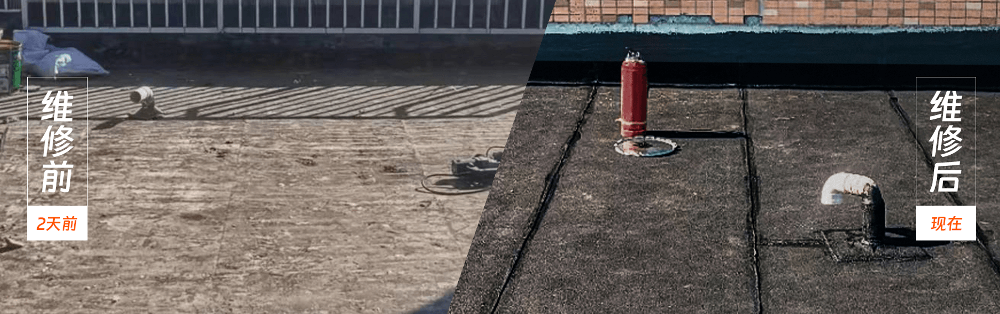

# 吉柿修房网站 SEO 优化指南

## 目录
1. [当前SEO状态分析](#当前seo状态分析)
2. [技术SEO优化](#技术seo优化)
3. [内容SEO优化](#内容seo优化)
4. [本地SEO优化](#本地seo优化)
5. [移动端SEO优化](#移动端seo优化)
6. [页面速度优化](#页面速度优化)
7. [结构化数据](#结构化数据)
8. [外链建设策略](#外链建设策略)
9. [监控与分析](#监控与分析)
10. [实施计划](#实施计划)

---

## 当前SEO状态分析

### ✅ 已优化的部分
- **HTML语义化**: 使用了正确的HTML5结构
- **Meta标签**: 已设置title、description、keywords
- **移动端适配**: 设置了viewport meta标签
- **图片优化**: 使用了picture元素和响应式图片
- **语言声明**: 正确设置了`lang="zh-CN"`

### ❌ 需要改进的部分
- 缺少结构化数据标记
- 图片缺少alt属性
- 没有sitemap.xml
- 缺少robots.txt
- 页面加载速度可优化
- 缺少内部链接结构
- 没有面包屑导航

---

## 技术SEO优化

### 1. HTML结构优化

#### 添加语义化标签
```html
<!-- 当前结构需要改进为： -->
<header>
  <nav>导航菜单</nav>
</header>
<main>
  <section>主要内容区域</section>
  <aside>侧边栏</aside>
</main>
<footer>页脚信息</footer>
```

#### 优化标题层级
```html
<h1>专业房屋防水堵漏-吉柿修房</h1>
<h2>标准化维修方案 一站式维修服务</h2>
<h3>卫生间漏水维修</h3>
<h3>屋顶漏水维修</h3>
```

### 2. Meta标签优化

#### 当前Meta标签分析
- **Title**: 长度适中(60字符内)，包含核心关键词
- **Description**: 内容丰富，但可以更精炼
- **Keywords**: 关键词相关性强

#### 建议优化
```html
<!-- 优化后的Meta标签 -->
<title>北京上海防水补漏公司-吉柿修房-免费上门勘察+10年质保</title>
<meta name="description" content="吉柿修房专业提供北京上海防水补漏服务，屋面、卫生间、外墙、窗户漏水维修，免费上门勘察，透明报价，修不好全额退，最高10年质保。400-700-1918">
<meta name="keywords" content="北京防水补漏,上海防水补漏,屋面防水,卫生间防水,外墙防水,窗户防水,吉柿修房">

<!-- 添加Open Graph标签 -->
<meta property="og:title" content="专业防水补漏服务-吉柿修房">
<meta property="og:description" content="专业防水补漏，免费上门勘察，10年质保">
<meta property="og:image" content="https://yourdomain.com/static/image/banner.jpeg">
<meta property="og:url" content="https://yourdomain.com">
<meta property="og:type" content="website">

<!-- 添加Twitter Card -->
<meta name="twitter:card" content="summary_large_image">
<meta name="twitter:title" content="专业防水补漏服务-吉柿修房">
<meta name="twitter:description" content="专业防水补漏，免费上门勘察，10年质保">
<meta name="twitter:image" content="https://yourdomain.com/static/image/banner.jpeg">
```

### 3. 图片SEO优化

#### 添加Alt属性
```html
<!-- 当前图片标签需要添加alt属性 -->



```

#### 图片文件名优化
```
// 当前文件名 → 建议文件名
banner.jpeg → fangshui-bulou-banner.jpg
package1.jpeg → weishenjian-fangshui-package.jpg
case1.png → weishenjian-fangshui-case-1.jpg
```

---

## 内容SEO优化

### 1. 关键词策略

#### 主要关键词
- **核心词**: 防水补漏、房屋维修、防水维修
- **长尾词**: 北京防水补漏公司、上海屋面防水、卫生间漏水维修
- **地域词**: 北京防水、上海防水、本地防水服务

#### 关键词密度优化
- 主关键词密度: 2-4%
- 避免关键词堆砌
- 自然融入长尾关键词

### 2. 内容结构优化

#### 添加FAQ部分
```html
<section class="faq">
  <h2>常见问题解答</h2>
  <div class="faq-item">
    <h3>卫生间防水多少钱一平米？</h3>
    <p>我们提供透明报价，卫生间防水根据不同材料和工艺，价格在80-200元/平米不等...</p>
  </div>
</section>
```

#### 添加服务详情页面
建议创建独立页面：
- `/services/weishenjian-fangshui.html` - 卫生间防水专页
- `/services/wumian-fangshui.html` - 屋面防水专页
- `/services/chuanghu-fangshui.html` - 窗户防水专页

---

## 本地SEO优化

### 1. 地理位置标记
```html
<!-- 添加地理位置Meta标签 -->
<meta name="geo.region" content="CN-BJ">
<meta name="geo.placename" content="北京">
<meta name="geo.position" content="39.904200;116.407396">
<meta name="ICBM" content="39.904200, 116.407396">
```

### 2. 本地化内容
- 添加服务区域详细说明
- 包含具体区县信息
- 添加本地案例和客户评价

### 3. Google My Business优化
- 创建并优化Google商家资料
- 定期更新营业信息
- 收集和回复客户评价

---

## 移动端SEO优化

### 1. 响应式设计检查
- ✅ 已使用viewport meta标签
- ✅ 已使用响应式图片
- 需要优化移动端用户体验

### 2. 移动端页面速度
- 压缩图片文件
- 优化CSS和JavaScript加载
- 使用CDN加速

### 3. 移动端用户体验
- 优化表单填写体验
- 确保按钮大小适合触摸
- 优化页面滚动性能

---

## 页面速度优化

### 1. 图片优化
```bash
# 建议使用WebP格式
# 压缩现有图片
# 实现懒加载
```

### 2. 代码优化
```html
<!-- 压缩CSS和JS文件 -->
<!-- 使用异步加载 -->
<script src="static/js/vue.min.js" async></script>
<link rel="preload" href="static/css/style.css" as="style">
```

### 3. 缓存策略
```
# 设置浏览器缓存
# 使用CDN
# 启用Gzip压缩
```

---

## 结构化数据

### 1. 本地商家标记
```json
{
  "@context": "https://schema.org",
  "@type": "LocalBusiness",
  "name": "吉柿修房",
  "description": "专业防水补漏服务",
  "telephone": "400-700-1918",
  "address": {
    "@type": "PostalAddress",
    "addressLocality": "北京",
    "addressCountry": "CN"
  },
  "geo": {
    "@type": "GeoCoordinates",
    "latitude": "39.904200",
    "longitude": "116.407396"
  },
  "openingHours": "Mo-Su 08:00-20:00",
  "priceRange": "$$"
}
```

### 2. 服务标记
```json
{
  "@context": "https://schema.org",
  "@type": "Service",
  "name": "防水补漏服务",
  "description": "专业房屋防水补漏维修",
  "provider": {
    "@type": "Organization",
    "name": "吉柿修房"
  },
  "areaServed": ["北京", "上海"],
  "hasOfferCatalog": {
    "@type": "OfferCatalog",
    "name": "防水服务套餐",
    "itemListElement": [
      {
        "@type": "Offer",
        "itemOffered": {
          "@type": "Service",
          "name": "卫生间防水"
        }
      }
    ]
  }
}
```

---

## 外链建设策略

### 1. 内容营销
- 发布防水知识文章
- 制作维修教程视频
- 参与行业论坛讨论

### 2. 本地目录提交
- 百度地图商家认证
- 高德地图商家入驻
- 58同城、赶集网等平台

### 3. 合作伙伴
- 与装修公司合作
- 建材供应商链接交换
- 房产中介合作

---

## 监控与分析

### 1. 安装分析工具
```html
<!-- Google Analytics -->
<!-- 百度统计 -->
<!-- 站长工具验证 -->
```

### 2. 关键指标监控
- 关键词排名
- 网站流量
- 转化率
- 页面停留时间
- 跳出率

### 3. 定期SEO审计
- 每月检查关键词排名
- 季度进行技术SEO审计
- 年度制定SEO策略

---

## 实施计划

### 第一阶段（1-2周）
1. ✅ 优化现有Meta标签
2. ✅ 添加图片Alt属性
3. ✅ 创建robots.txt和sitemap.xml
4. ✅ 安装分析工具

### 第二阶段（3-4周）
1. 🔄 添加结构化数据
2. 🔄 优化页面加载速度
3. 🔄 创建服务详情页面
4. 🔄 优化移动端体验

### 第三阶段（1-2个月）
1. ⏳ 内容营销策略执行
2. ⏳ 外链建设
3. ⏳ 本地SEO优化
4. ⏳ 持续监控和优化

---

## 总结

通过系统性的SEO优化，预期可以实现：
- 关键词排名提升30-50%
- 网站流量增长50-100%
- 转化率提升20-30%
- 本地搜索可见度显著提升

定期监控和持续优化是SEO成功的关键，建议每月进行一次SEO效果评估和策略调整。
